# Project Tree — Portfolio Frontend Enhancement

```mermaid
graph TD
    A[Portfolio Homepage] --> B[Hero Section]
    A --> C[Problems Section]
    A --> D[Services Section]
    A --> E[Process Section]
    A --> F[Projects Section]
    A --> G[About Section]
    A --> H[Contact Section]
    A --> I[Navigation]
    A --> J[Footer]
    
    B --> B1[Typing effect headline]
    B --> B2[Social proof badges]
    B --> B3[Scroll indicator]
    
    C --> C1[Problem/Solution reveal cards]
    C --> C2[Custom SVG illustrations]
    C --> C3[Scroll animations]
    
    D --> D1[Pricing badges]
    D --> D2[CTA buttons per card]
    D --> D3[Expanded feature lists]
    D --> D4[Rich hover effects]
    
    E --> E1[Step icons]
    E --> E2[Timeline labels]
    E --> E3[Animated connector]
    
    F --> F1[LeadSpark project]
    F --> F2[Analytics Dashboard project]
    F --> F3[Osteria Bellavista project]
    F --> F4[Hover overlay links]
    
    G --> G1[Stats row]
    G --> G2[Career timeline]
    G --> G3[Enhanced photo frame]
    
    H --> H1[Project type select]
    H --> H2[Calendly CTA]
    H --> H3[Trust badges]
    
    I --> I1[Active scroll state]
    J --> J1[Sitemap + social links]
```

## Acceptance Criteria

### Hero
- [ ] Headline ha typing effect o word rotate
- [ ] Badge social proof visibili sotto CTA
- [ ] Scroll bounce indicator alla base
- [ ] Animazioni rispettano `prefers-reduced-motion`

### Problems  
- [ ] Ogni card ha hover reveal con soluzione
- [ ] Icone SVG custom per ogni problema
- [ ] Scroll reveal con `data-animate`

### Services
- [ ] Prezzi visibili su ogni card
- [ ] CTA button in ogni card
- [ ] Feature list completa per tutti i servizi
- [ ] Hover effetto translateY + shadow

### Process
- [ ] Icona SVG per ogni step
- [ ] Tempistiche sotto ogni titolo
- [ ] Linea animata on scroll

### Projects
- [ ] 3 progetti reali con descrizioni accurate
- [ ] Mock screenshot per LeadSpark e Analytics
- [ ] Link Live demo / GitHub dove applicabile
- [ ] Overlay su hover

### About
- [ ] 4 stats visibili in riga
- [ ] Mini timeline con 3 milestone
- [ ] Foto con frame gradient migliorato

### Contact
- [ ] Select "Tipo di progetto"
- [ ] CTA Calendly visibile
- [ ] 3 trust badges sotto form

### Nav / Footer
- [ ] Nav link evidenzia sezione attiva durante scroll
- [ ] Footer ha sitemap, social, privacy
